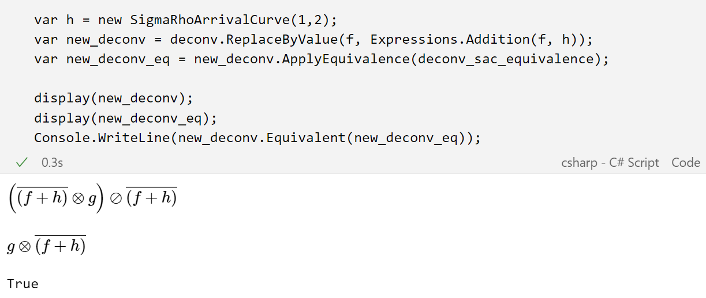
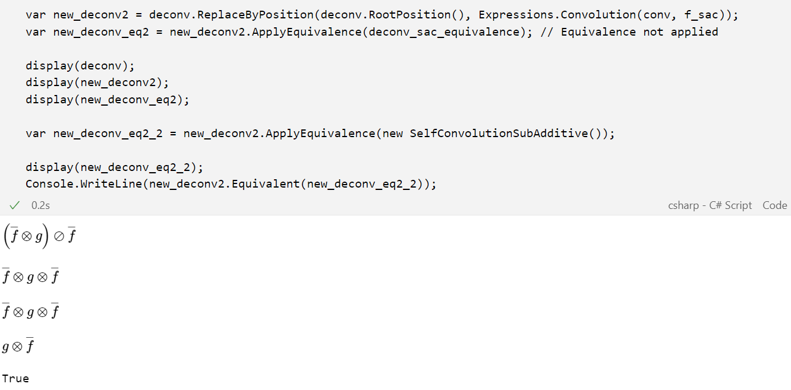
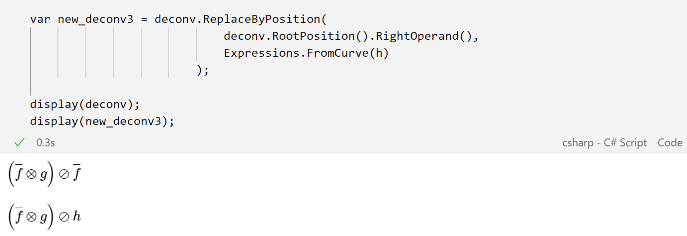

# Expressions Manipulation

This notebook contains examples about the flexible manipulation of expressions provided by *Nancy.Expressions*. 
In particular, the library allows to apply equivalences to (sub-parts of) expressions that may reduce their computational complexity.
Equivalences can be either user-defined ones or well-known ones (already reported in literature and implemented in the library).
Furthermore, the user can also replace parts of expressions by specifying which sub-expression needs to be substituted (replace _by-value_) or using its position (replace _by-position_).

## Expression simplification

The following code cell constructs the DNC expression $(\overline{f} \otimes g) \oslash \overline{f}$.

```
var f = Expressions.FromCurve(
    curve: new Curve(<args>), 
    name: "f");
var g = Expressions.FromCurve(
    curve: new Curve(<args>),
    name: "g");
var f_sac = f.SubAdditiveClosure();
var conv = Expressions.Convolution(f_sac, g);
var deconv = Expressions.Deconvolution(conv, f_sac);
```

The expression $(\overline{f} \otimes g) \oslash \overline{f}$ is equivalent to $\overline{f} \otimes g$ which allows to avoid completely the deconvolution operation.
Therefore, it is possible to manually simplify the expression by using the method `ApplyEquivalence` and the class `DeconvAndSubAdditiveClosure` which represents the simplification:

```
var deconv_sac_equivalence = new DeconvAndSubAdditiveClosure();
var deconv_eq = deconv.ApplyEquivalence(deconv_sac_equivalence);
```

## Replacement *by-value*

Substitute all occurences of $f$ with $f + h$, and re-apply the previous equivalence:



## Replacement *by-position*

Substitute the deconvolution with a convolution, and re-apply the previous equivalence (which does not hold in this case). Another equivalence can be applied in this case: $f \otimes f = f$, when $f$ is subadditive, as shown in the following screen:



Other example: replace the right operand of the deconvolution with $h$ from the initial expression.

