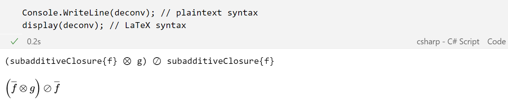
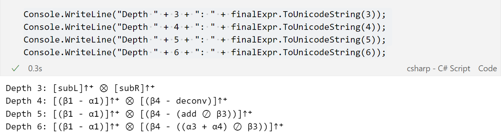

# Expression Visualization

This notebook contains examples highlighting the flexibility of the visualization of DNC expressions usig *Nancy.Expressions*.

After constructing a DNC expression, such as $(\overline{f} \otimes g) \oslash \overline{f}$, it is possible to visualize it using the Unicode character set or Latex style (the latter can be used only inside notebooks supporting markdown cells).



Another kind of flexibility is provided by allowing to print DNC expressions at different levels of detail. This feature is especially useful when expressions are huge and difficult to read if fully printed.

To provide such feature each method for the construction of the expressions allows the user to specify the expression name. Therefore, when visualizing an expression the user can select the depth at which the expression tree must be fully expanded: this means that operations before said depth will be printed esplicitly, deeper operations, instaed, will be hidden and collapsed by printing only the expression name (if set) of nodes at said depth.

The next code cell shows how to specify the name of the expressions (and sub-expressions) being constructed.

```
// initialization of curves

var exprLeft = Expressions.Subtraction(beta1, alpha1, expressionName:"subL")
    .ToUpperNonDecreasing()
    .ToNonNegative();

var  b3 = Expressions.FromCurve(beta3);
var temp1 = Expressions.Addition(alpha3, alpha4).WithName("add")
    .Deconvolution(b3, expressionName:"deconv");
var exprRight = Expressions.Subtraction(beta4, temp1, expressionName:"subR")
    .ToUpperNonDecreasing()
    .ToNonNegative();

var finalExpr =  Expressions.Convolution(exprLeft, exprRight, expressionName:"conv");
```

Now, we print the final expression at different levels of detail.



