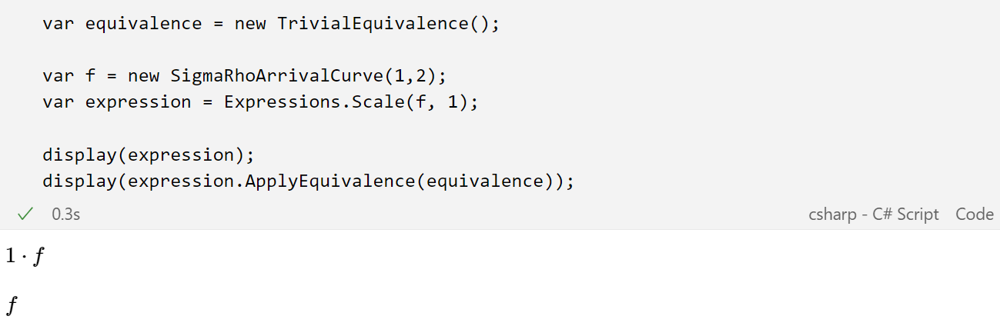
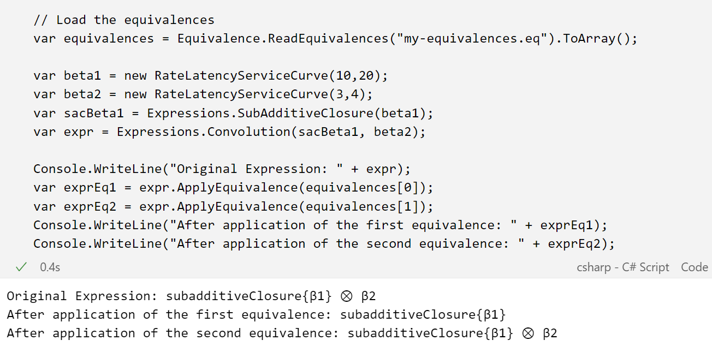

In this example we show how the user can define a new equivalence in _Nancy.Expressions_.
There are two possibilities:
1) Programmatic way, specializing the `Equivalence` class;
2) Textual way, writing the equivalence following the syntax defined in the library (NetCalG.g4 file in Grammar directory of the library).

## Programmatic way

The following code cell defines the trivial equivalence $a*f = f$, with $a \in \mathcal{Q}, a=1$.

```
public class TrivialEquivalence : Equivalence
{
    public TrivialEquivalence() :
        base(
            leftSideExpression: Expressions.Scale(Expressions.Placeholder("f"), Expressions.RationalPlaceholder("a")),
            rightSideExpression: Expressions.Placeholder("f")
            )
    {
        AddHypothesis("a", (RationalExpression a) => a.Value == 1);
    }
}
```

Use of the equivalence:



## Textual way

Two equivalences are defined, following the syntax specified in *Nancy.Expressions*, inside the file *my-equivalences.eq*.
The snippet of code in the following screenshot reads the two equivalences and creates the corresponding `Equivalence` objects, then they are applied to some expressions.



