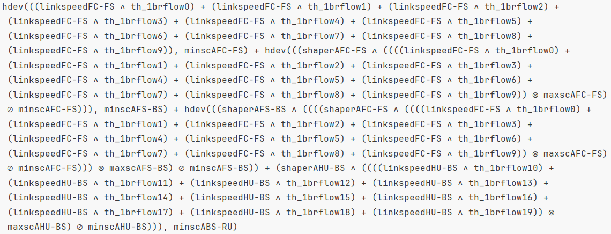

# NPBA

NPBA (Network Performance Bounds Analyzer) is an interactive tool that can be used for performance bound calculation in TSN and non-TSN networks, and it exploits DNC modeling. 
It provides methods to create a visual representation of a network, generate random networks, calculate end-to-end delay and backlog bounds, and plot results. 
The tool, published as open source (https://github.com/rzippo/npba/tree/c580159bee8c285c4fcfcb8ee7bc0b0eac4a7622), provides three implementations for its computation parts: a custom Python implementation, one based on _RTC Toolbox_, and one based on _Nancy_. 
In particular, for the third one, it also provides a test program which computes the worst-case bounds for a Credit-Based Shaper (CBS).
This test program is the one reported in this directory, both using _Nancy_ and _Nancy.Expressions_ (our new library).

Thanks to using _Nancy.Expressions_, we easily obtained the visualization of the expressions that are computed in the program.

<figure>
    
</figure>

