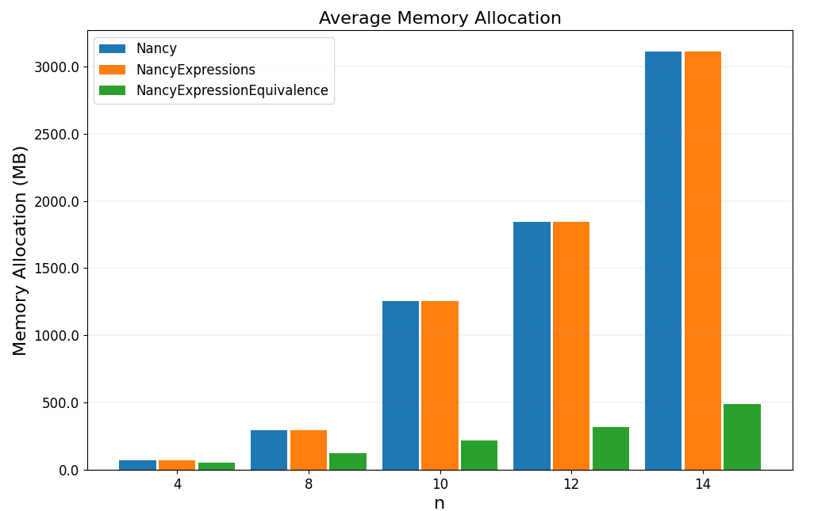

# Flow-controlled networks - Benchmark
This directory contains a project which implements three benchmarks for comparing the performance of _Nancy_ and _Nancy.Expressions_ in evaluating an expression.
The expression used for the test is the number 12 in the paper "Computationally Efficient Worst-Case Analysis of Flow-Controlled Networks With Network Calculus" (https://ieeexplore.ieee.org/stamp/stamp.jsp?tp=&arnumber=10042451).
We compared the performance, in terms of execution time and memory allocation, in the three following cases:
1) Evaluation of the expression using _Nancy_.
2) Evaluation of the expression using _Nancy.Expressions_ without making any simplification.
3) Evaluation of the expression using _Nancy.Expressions_ applying a simplification to the expression.

The applied simplification is obtained by exploiting the equivalence $f \otimes f = f$ when $f$ is subadditive, exactly as done in the paper "by hand".
This simplification allows to reduce the number of convolutions to be computed from $\mathcal{O}(n^2)$ to $\mathcal{O}(n)$ where $n$ is the number of nodes of the network.
The following plots show the obtained results, in terms of execution time and memory allocation, for different values of $n$.

<figure>
    
</figure>

<figure>
    
</figure>

